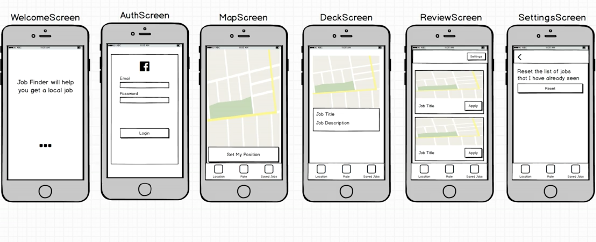
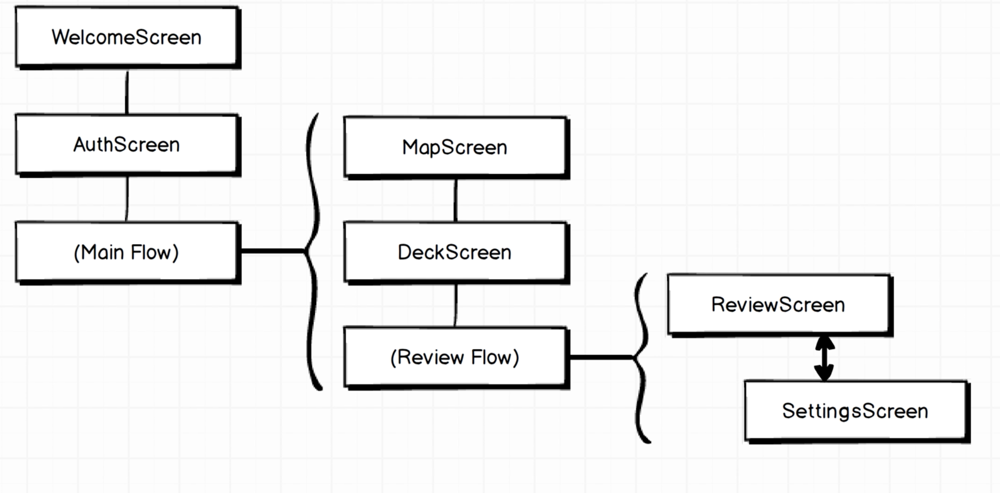
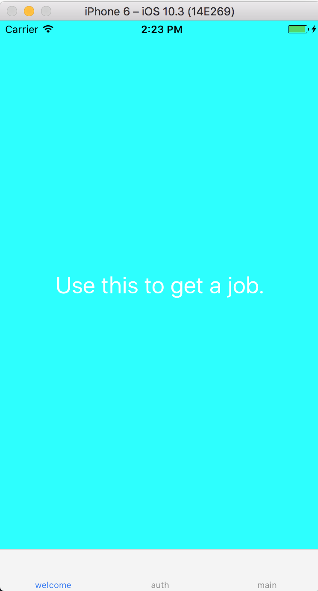
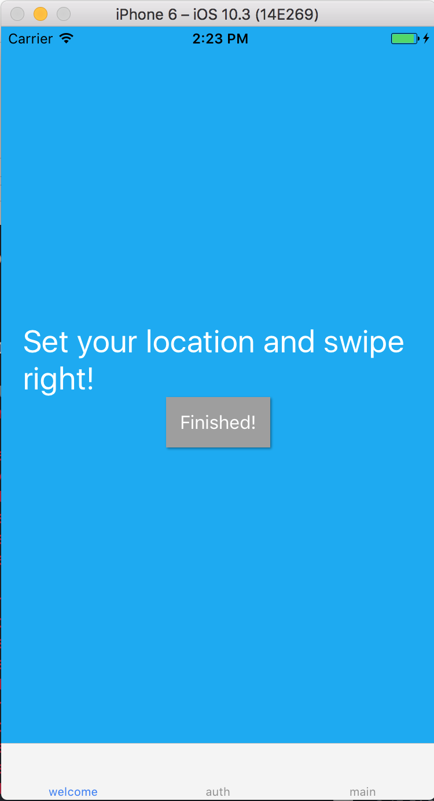

# jobs-react-native
Jobs search application using Indeed API, [React Navigation](https://reactnavigation.org/docs/intro/), and maps.

*Disclaimer: I followed through Stephen Grinder's [Advanced React Native](https://www.udemy.com/react-native-advanced/).
However, due to explosive growth and constant improvements of React Native, by the time I followed through his lecture, syntax and some navigation codes are outdated. I overcame these challenges by going to their official documentations in [navigations](https://reactnavigation.org/docs) and [react native](https://facebook.github.io/react-native). IF YOU ARE GOING TO FOLLOW HIS LECTURE, MAKE SURE TO CHECK `package.json` first to match the versions*

### Overview
All the screens that I will be working on.


How these screens are related to each other.


### Setting up
Installing `react-navigation`
```bash
npm install --save react-navigation
```

Installing `react-native-elements`
```bash
npm install --save react-native-elements
```

### Coding Standards
I am currently following coding Standards from [airbnb](https://github.com/airbnb/javascript/tree/master/react).

### Tutorials Screen
This [Tutorials screen](jobs/components/Slides.js) will introduce users what this app is about and how it will work!
  
